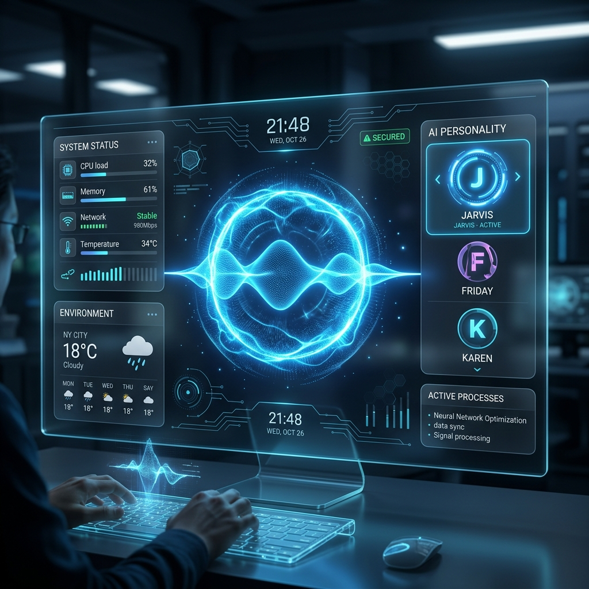
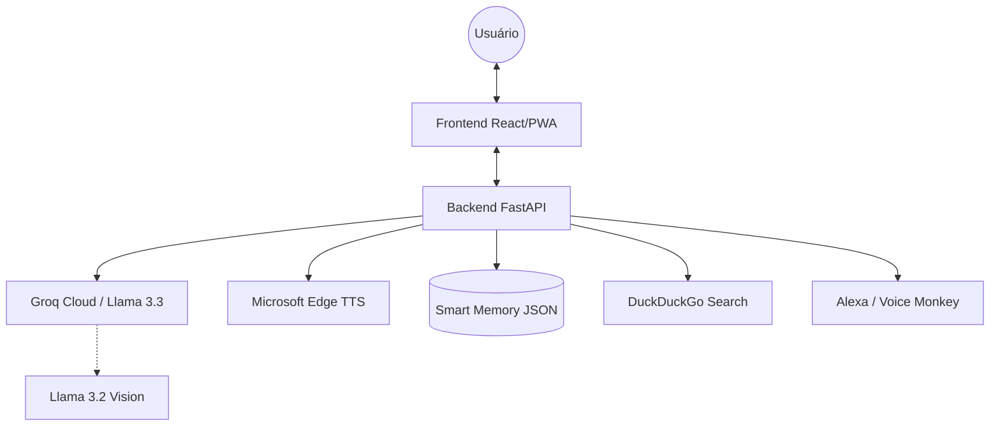

# 🦾 J.A.R.V.I.S - Intelligent OS MVP

[](https://opensource.org/licenses/MIT)
[](https://fastapi.tiangolo.com/)
[](https://react.dev/)
[](https://groq.com/)

Um assistente virtual híbrido de próxima geração inspirado no **J.A.R.V.I.S.** do Homem de Ferro. Este projeto integra inteligência artificial de ponta, síntese de voz natural e automação residencial em uma interface HUD (Heads-Up Display) futurista.



## ✨ Funcionalidades Principais

- 🧠 **Múltiplas Personas**: Escolha entre **Jarvis** (Formal), **Friday** (Sarcástica) ou **Karen** (Amigável), cada uma com voz e comportamento únicos.
- 🎙️ **Síntese de Voz Premium**: Integração com Microsoft Edge TTS para vozes neurais naturais e fluidas.
- 👁️ **Visão Computacional**: Suporte para análise de imagens usando Llama 3.2 Vision.
- 🌐 **Busca em Tempo Real**: Capacidade de pesquisar na web para fornecer informações atualizadas.
- 🏠 **Automação Alexa**: Disparo de rotinas da Alexa via webhooks (Voice Monkey).
- 📝 **Memória Persistente**: Sistema inteligente que extrai e lembra fatos sobre o usuário para conversas contextualizadas.
- 📡 **NDJSON Streaming**: Respostas de texto e áudio transmitidas em tempo real para latência ultra-baixa.
- 📊 **Monitoramento HUD**: Painel de telemetria em tempo real (CPU, RAM, Disco) integrado na interface.
- 🕵️ **Rastreabilidade**: Sistema de logs estruturados e tracing via OpenTelemetry.
- 🎙️ **Alexa Skill**: Endpoint nativo para integrar o Jarvis como uma Skill da Alexa.
- 📱 **PWA & Mobile Ready**: Interface responsiva com suporte a PWA e Capacitor para uso nativo em iOS/Android.

## 🛠️ Stack Tecnológica

### Backend
- **Framework**: FastAPI (Python 3.10+)
- **IA**: Groq (Llama 3.3 70B / 3.1 8B) & Ollama (Backup Local)
- **Voz**: Edge-TTS (Microsoft Azure Neural Voices)
- **Busca**: DuckDuckGo Search API
- **Banco de Dados**: JSON-based Smart Memory
- **Monitoramento**: psutil, Prometheus & OpenTelemetry

### Frontend
- **Framework**: React 19 + Vite
- **Linguagem**: TypeScript
- **Animações**: Framer Motion
- **Icons**: Lucide React
- **Mobile**: Capacitor.js & Vite PWA

## 🏗️ Arquitetura do Sistema



## 🚀 Como Iniciar

### Pré-requisitos
- Docker & Docker Compose (Recomendado)
- Python 3.10+ (Para rodar localmente)
- Node.js 20+ (Para rodar localmente)

### 🐳 Via Docker (Mais rápido)

1. Clone o repositório:
   ```bash
   git clone https://github.com/eduhernandorena/jarvis-ai.git
   cd jarvis-ai
   ```

2. Configure suas chaves de API no arquivo `backend/.env`:
   ```env
   GROQ_API_KEY=gsk_...
   VOICEMONKEY_TOKEN=...
   VOICEMONKEY_SECRET=... # Opcional
   ```

3. Inicie os containers:
   ```bash
   docker-compose up --build
   ```
   O sistema estará disponível em `http://localhost:8000`.

### 🐍 Instalação Local (Desenvolvimento)

#### Backend
```bash
cd backend
python -m venv venv
source venv/bin/activate # Windows: venv\Scripts\activate
pip install -r requirements.txt
python main.py
```

#### Frontend
```bash
cd frontend
npm install
npm run dev
```

## 🧪 Testes

O projeto utiliza **BDD (Behavior Driven Development)** para garantir que o comportamento do assistente esteja alinhado com as expectativas.

```bash
cd backend
python -m pytest tests/test_jarvis.py
```

## 📱 Mobile (PWA & Native)

- **PWA**: Acesse o app no navegador do celular e selecione "Adicionar à Tela de Início".
- **Nativo**: O projeto está pré-configurado com Capacitor. Para rodar no Android/iOS:
  ```bash
  cd frontend
  npm run build
  npx cap sync
  npx cap open android # ou ios
  ```

---

*Desenvolvido por Edu Hernandorena. Inspirado pela visão de Tony Stark de um futuro assistido por IA.*
